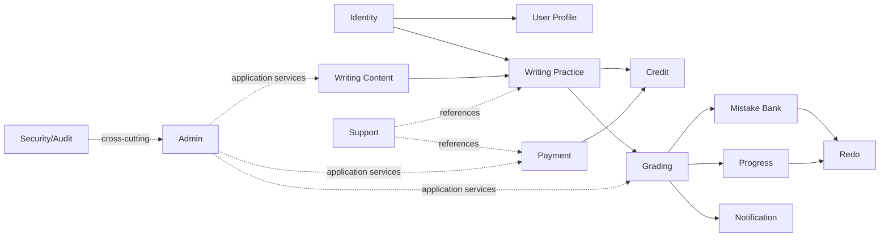
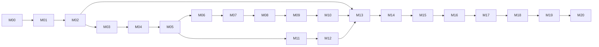

# BandUp — Implementation Plan

Phiên bản planning baseline: 1.0 — 18/07/2026  
Đối tượng: solo developer, reviewer và Codex trong các phiên triển khai sau.

## 1. Nguồn và trạng thái repository

Đã dùng toàn bộ nội dung của sáu nguồn: `01_BandUp_Overview.tex`, `02_Product_Requirements.tex`, `03_UI_UX_Design.tex`, `04_System_Design.tex`, `05_Development_Roadmap.tex`, `06_Operations.tex`. File `.tex` là nguồn chính; PDF chỉ là bản render. Tên overview thực tế khác tên trong yêu cầu ban đầu. `README.md`, `AGENTS.md`, `.gitignore` ban đầu rỗng; chưa có application source/config và workspace hiện không phải Git worktree.

## 2. Báo cáo phân tích A–L

### A. Sản phẩm và core flow

BandUp là Desktop Web AI Writing Coach cho IELTS Writing Task 2, không phải giám khảo IELTS chính thức. Core flow:

`Google Login → Local User/Onboarding → Prompt → Writing Room → Draft/Autosave → Submit → Reserve Credit → Hangfire → Structured AI Assessment → Consume/Release Credit → Result → Mistake/Progress/Redo`.

Payment, support, admin, security và operations bảo vệ vòng lặp này; mobile/community/classroom nằm sau Web ổn định. Nguồn: Overview §Tầm nhìn–Giải pháp; PRD §User Journey; UI §Kết luận.

### B. Module nghiệp vụ

Identity, User Profile, Writing Content, Writing Practice, Grading, Mistake Bank, Progress, Redo, Credit, Payment, Support, Notification, Admin, Security, Analytics. Owner/data boundary theo System Design §Các module nghiệp vụ.

### C. Dependency module



Không có module nào được sửa bảng của module khác. Credit chỉ thay đổi qua Credit service; Payment chỉ yêu cầu grant; Admin chỉ orchestration qua application service.

### D. Quyết định đã hoàn tất

Desktop Web-first; Modular Monolith; React/TypeScript/Vite; ASP.NET Core; PostgreSQL/EF Core; Google OIDC + BandUp cookie; role/permission/policy/ownership; multi-role/multi-user-role; Hangfire; API/Worker tách production; một OpenAI model chính với structured output backend-validated; ledger/reservation; payOS/VietQR; VPS/Compose/reverse proxy; tách môi trường; no-secret/no-sensitive-log; deletion learning data và anonymization financial data. Chi tiết: System Design §Các quyết định kiến trúc đã chốt và PRD §Quyết định đã chốt.

### E. Quyết định thiếu

Model/version, assessment schema/rubric, giá/gói/expiry, refund, retention, RPO/RTO, object storage, rate/concurrency/budget, session/re-auth, CSRF, permission catalog/bootstrap, Admin MVP cut, beta thresholds và Hangfire PostgreSQL readiness. Theo dõi tại [09_Open_Decisions.md](09_Open_Decisions.md).

### F. Mâu thuẫn giữa tài liệu

Tên/path overview; subscription cũ so với credit package; khác nhau giữa “feature MVP” và “production-ready MVP”; kích thước Admin Portal; model cụ thể trong AC so với model configurable; accessibility nền tảng so với audit P2. Không mâu thuẫn nào được giải quyết âm thầm; disposition ở `CF-001..006`.

### G. Requirement thiếu thiết kế kỹ thuật

Thiếu chi tiết account linking, canonical word count, autosave conflict, assessment schema compatibility, progress formula, payment edge states, deletion proof và analytics consent. Disposition và milestone block nằm trong `09_Open_Decisions.md`.

### H. Thiết kế kỹ thuật không có requirement tương ứng

Provider abstraction rộng, materialized Progress/Mistake aggregates, object storage cho essay text, advanced admin analytics và multi-provider chưa có requirement MVP đủ mạnh. Chỉ giữ boundary tối thiểu; không triển khai framework hoặc hạ tầng sớm.

### I. Screen chưa ánh xạ một-một sang functional requirement

Một số screen chi tiết chỉ ánh xạ tới nhóm FR, chưa có FR riêng; chúng dùng UI Acceptance Checklist và phải tạo change record nếu phát sinh business behavior mới. Danh sách cụ thể ở `09_Open_Decisions.md` §Screen chưa có functional mapping một-một.

### J. Rủi ro refactor lớn

1. Sai ledger/idempotency/state machine; 2. assessment schema không version; 3. module dùng chung DbContext nhưng không giữ ownership; 4. hard-code model/price/permission; 5. Hangfire provider không đáp ứng lock/restart; 6. deletion/retention thiết kế muộn; 7. Admin Portal thành mega-feature; 8. production topology khác local quá xa.

### K. Over-engineering MVP

Microservices/Kubernetes/Kafka/Redis/SignalR, provider framework tổng quát, materialized aggregates sớm, object storage cho essay text, advanced KPI/multi-provider/advanced analytics. Chỉ thêm khi có requirement và số liệu.

### L. Bắt buộc nhưng không nằm trong “feature MVP”

Legal/AI disclosure, security/CSRF/audit, secret management, backup/restore, monitoring/alerting, reconciliation, deletion/retention, runbook/rollback/incident ownership và accessibility cơ bản. Đây là release criteria, không phải tùy chọn Post-MVP.

## 3. Kiến trúc triển khai và repository đích

```text
BandUp/
├─ apps/web/                    # React + TypeScript + Vite (M01)
├─ src/
│  ├─ BandUp.Api/              # HTTP host, auth/cookie, composition (M01)
│  ├─ BandUp.Worker/           # Hangfire process host (M06)
│  ├─ BandUp.Contracts/        # public API/job/event contracts (M01/M06)
│  ├─ BandUp.SharedKernel/     # minimal primitives only (M01)
│  ├─ BandUp.Modules/          # folders by business module, added just-in-time
│  └─ BandUp.Infrastructure/   # persistence/provider adapters (M01+)
├─ tests/                      # unit, integration, architecture, E2E
├─ deploy/                     # local/staging/prod Compose, proxy (M01/M16)
├─ scripts/                    # repeatable checks/ops scripts (M01+)
└─ Docs/                       # baselines, ADRs, runbooks
```

Không tạo một project cho mỗi layer/module ngay M01. Bắt đầu với hosts, Contracts, SharedKernel tối thiểu, một Modules project/folder và Infrastructure; chỉ tách assembly khi architecture test hoặc deployment boundary mang lại giá trị. Dependency cấm được ghi trong `AGENTS.md`.

## 4. Milestone plan

Mỗi milestone là một PR/review unit; task chi tiết ở [08_Milestone_Backlog.md](08_Milestone_Backlog.md). Estimate là focused solo-developer time, chưa gồm chờ external account/owner.

### M00 — Planning Baseline (2–3 ngày)

**Goal:** bộ tài liệu có thể thực thi và truy vết. **Dependencies:** none.  
**In:** analysis A–L, milestone/backlog, open decisions, AGENTS, traceability. **Out:** source/scaffold.  
**Deliverables:** bốn tài liệu planning; decision/ADR queue. **DB/BE/FE/Ops:** none.  
**Tests:** link/ID/status/P0 coverage review. **Gate:** tài liệu không để implementer tự quyết architecture/scope; blocker có owner/gate.  
**Recovery:** tài liệu độc lập, revert riêng. **Risk:** mapping nhóm quá rộng; kiểm tra inventory trước mỗi milestone.

### M01 — Repository and Foundation (5–7 ngày)

**Goal:** skeleton local build/test chạy được. **Dependencies:** M00.  
**In:** minimal solution/web, PostgreSQL dev, migration mechanism, health checks, CI, Compose. **Out:** domain feature/auth thật.  
**DB:** database bootstrap + migration history only. **Security:** config validation, secret templates, no production secrets.  
**Tests:** build/type/lint, API health+DB readiness, architecture dependency, Compose smoke.  
**Gate:** Roadmap Gate 1 Foundation Ready; commands cập nhật AGENTS/README. **Recovery:** recreate disposable dev DB; no user data. **Estimate:** 40–56h.

### M02 — Identity and Authorization (7–9 ngày)

**Goal:** Google → unique local user → secure cookie; ownership/policy enforced. **Dependencies:** M01, OD-009/010.  
**In:** login/callback/logout, account state, sessions/data-protection, roles/permissions, profile/onboarding, CSRF. **Out:** full Admin UI.  
**DB:** Users, ExternalLogins `(Issuer,Subject)` unique, Sessions/key strategy, Roles, Permissions, UserRoles, RolePermissions, UserProfiles; admin bootstrap audited.  
**Tests:** fake OIDC integration, repeat login, blocked state, cookie flags/expiry, CSRF, USER/admin/ownership matrix.  
**Gate:** AC-AUTH-001..004, AC-DASH-001; no endpoint trusts hidden menu. **Recovery:** disable login/callback; rollback additive schema only before real users. **Estimate:** 56–72h.

### M03 — Prompt and Learner Shell (5–7 ngày)

**Goal:** authenticated learner can onboard, browse/select active prompt. **Dependencies:** M02.  
**In:** shell/dashboard, prompt list/filter/random/detail, minimal controlled seed/admin path. **Out:** Model Essay/full CMS.  
**DB:** WritingPrompts + PromptTags; `PromptNumber` unique; status/published indexes; seed small reviewed dataset.  
**Tests:** active-only, random no-near-repeat, ownership/navigation, UI states/accessibility.  
**Gate:** AC-PROMPT-001/002 and learner can reach selected prompt. **Recovery:** archive seed rather than hard-delete used content. **Estimate:** 40–56h.

### M04 — Writing Room and Draft (7–9 ngày)

**Goal:** writing session survives normal refresh/offline/conflict. **Dependencies:** M03.  
**In:** editor, timer/pause, canonical word count, autosave ≤10s target, optimistic version, local recovery, exit warning. **Out:** submit/credit.  
**DB:** WritingDrafts; unique active draft policy; row version/concurrency token; owner/prompt/status indexes.  
**Tests:** autosave timing, retry/offline, refresh, pause, two-tab stale version, cross-user access, recovery UX.  
**Gate:** AC-WRITE-001/002; no silent overwrite and measured loss window ≤10s. **Recovery:** retain previous server version/local copy; migration additive. **Estimate:** 56–72h.

### M05 — Submission and Credit Reservation (7–9 ngày)

**Goal:** idempotent submission atomically reserves credit. **Dependencies:** M04.  
**In:** wallet/ledger/reservation, word rule, submit confirmation/status, idempotency. **Out:** job/AI/payment.  
**DB:** CreditWallets, CreditTransactions, CreditReservations, WritingSubmissions, IdempotencyRecords; unique request/reservation/submission relationships and state checks.  
**Transaction:** validate owner/rules → reserve → create submission in one transaction.  
**Tests:** <200, 200–249 confirm, valid range, insufficient balance, double-click/network retry, concurrent last-credit, ownership.  
**Gate:** AC-SUB-001..004, AC-BILL-001; ledger reconciles. **Recovery:** release orphan reservation via explicit recovery, never edit ledger. **Estimate:** 56–72h.

### M06 — Hangfire and Fake Grading (6–8 ngày)

**Goal:** asynchronous end-to-end flow with deterministic fake result. **Dependencies:** M05, OD-017.  
**In:** Worker host, PostgreSQL storage spike, queues, job contract, fake grader, retry/recovery/idempotency. **Out:** OpenAI call.  
**DB:** Hangfire schema via provider plus GradingAttempts/Assessments skeleton; unique successful assessment/submission.  
**Tests:** enqueue, restart, retry, duplicate execution, multi-worker lock, stale-job recovery, API/Worker compatibility.  
**Gate:** fake `QUEUED→PROCESSING→COMPLETED|FAILED`, exactly-one result/credit transition; provider spike passes. **Recovery:** pause queue, requeue by submission ID; keep job arguments identifiers only. **Estimate:** 48–64h.

### M07 — OpenAI Grading (8–10 ngày)

**Goal:** replace fake provider with validated, observable real grading. **Dependencies:** M06, OD-001/002.  
**In:** adapter, prompt/schema version, structured validation, usage/cost, bounded retry, circuit breaker, kill switch, injection defense. **Out:** advanced benchmark/dashboard.  
**DB:** PromptVersions, AiModelCalls/usage fields, Assessment schema version; no raw essay in operational log.  
**Tests:** contract/golden fixtures, timeout/429/5xx, 4xx, invalid schema/corrective retry, malicious essay, kill switch/budget, replay.  
**Gate:** AC-AI-001..005 and AC-ADMIN-002; no duplicate spend/assessment. **Recovery:** disable AI, preserve reservation for retry or release by terminal policy. **Estimate:** 64–80h.

### M08 — Result Vertical Slice (5–7 ngày)

**Goal:** complete first internal-alpha learning slice. **Dependencies:** M07.  
**In:** polling status, result progressive disclosure, corrections/vocabulary/plan, safe render, notification basic, capture/release.  
**DB:** finalize normalized/JSON assessment representation; immutable after success except explicit versioned re-grade.  
**Tests:** owner-only result, polling terminal states, XSS payload, successful capture, terminal release, refresh/deep link.  
**Gate:** Roadmap Gate 2+3; AC-RESULT-001/002, AC-BILL-002/003; demo complete from Google login to result. **Estimate:** 40–56h.

### M09 — Model Essay and History (5–7 ngày)

**Goal:** learner revisits work and approved reference content. **Dependencies:** M08.  
**DB:** ModelEssays with status/version/source/license and prompt unique active approval; indexes for submission history.  
**Tests:** approved-only, pagination/filter, owner-only detail, archived prompt/history behavior.  
**Gate:** AC-MODEL-001, history screens USER-09/10 complete. **Recovery:** archive content, never erase referenced version. **Estimate:** 40–56h.

### M10 — Mistake, Progress and Redo (8–10 ngày)

**Goal:** close long-term improvement loop. **Dependencies:** M08; M09 for history navigation.  
**DB:** ErrorTaxonomies, ErrorOccurrences snapshot, optional derived stats, Redo links/recommendations; only add materialized progress snapshot if measured.  
**Tests:** taxonomy version/archive, occurrence idempotency, sample-size-one, aggregate ownership, redo creates new submission, old/new comparison.  
**Gate:** AC-MISTAKE-001, AC-PROGRESS-001, AC-REDO-001/002. **Recovery:** recompute derived projection from immutable assessments. **Estimate:** 64–80h.

### M11 — payOS and Wallet (8–10 ngày)

**Goal:** verified payment grants credit exactly once. **Dependencies:** M05, OD-003/004.  
**DB:** CreditPackages versioned, PaymentOrders, WebhookEvents unique provider event/order, PaymentCreditGrants unique payment, Refunds.  
**Transaction:** verified PAID event + grant ledger entry exactly once; return URL never grants.  
**Tests:** signature valid/invalid, duplicate/out-of-order/late webhook, return URL spoof, concurrent reconciliation, expiry, amount mismatch, payOS sandbox.  
**Gate:** AC-PAY-001..003, Roadmap Gate 4 payment/reconciliation; wallet invariant passes. **Recovery:** disable checkout, continue reconciliation; compensate via audited ledger, never mutate history. **Estimate:** 64–80h.

### M12 — Support and Notifications (6–8 ngày)

**Goal:** context-rich support and controlled resolution. **Dependencies:** M08/M11, OD-004.  
**DB:** SupportTickets/Messages/Links/Attachments metadata, Notifications/DeliveryAttempts; immutable resolution audit.  
**Tests:** owner-only ticket, failed grading link, payment link, quality dispute no auto-refund, permissioned re-grade/refund, notification idempotency.  
**Gate:** AC-SUPPORT-001/002; payment/grading incident has recoverable workflow. **Recovery:** disable attachment/email channel independently; in-app record remains. **Estimate:** 48–64h.

### M13 — Admin Portal (9–12 ngày)

**Goal:** minimum safe operations portal, delivered as small PR slices. **Dependencies:** M02/M03/M07/M11/M12, OD-011/012.  
**In:** prompt/model/taxonomy, user scoped view, credit/payment/support, grading failures/kill switch, app settings, role/permission, audit. **Out:** vanity KPI/advanced analytics if not release-critical.  
**DB:** AppSettings version/audit, SecurityEvents/AuditLogs; no duplicate copy of module data.  
**Tests:** permission matrix, direct URL/API denial, essay hidden by default, reason/confirmation/audit, multi-role union, session revoke.  
**Gate:** AC-ADMIN-001..003 and Basic Admin P0 cut. **Recovery:** feature flag each admin surface; actions remain backend policy-protected. **Estimate:** 72–96h.

### M14 — Security, Privacy and Deletion (8–10 ngày)

**Goal:** privacy/security controls meet Public MVP baseline. **Dependencies:** all data modules, OD-005/015.  
**In:** rate/abuse, CSP/XSS/CSRF review, privacy/legal/AI disclosure, retention jobs, re-auth deletion, learning-data purge, finance anonymization.  
**Tests:** OWASP-focused checks, IDOR matrix, injection, deletion retry/idempotency, anonymization, backup-expiry evidence, analytics/log redaction.  
**Gate:** AC-SEC-*, AC-DELETE-*, NFR-SEC/PRIV/LEGAL P0; no recoverable active learning profile after completion. **Recovery:** deletion is forward-only and resumable; legal hold/financial anonymization policy explicit. **Estimate:** 64–80h.

### M15 — Quality and Operational Readiness (7–10 ngày)

**Goal:** prove reliability, performance, cost and recoverability. **Dependencies:** M08/M11/M14, OD-006/008.  
**In:** full test pyramid, AI benchmark, load/concurrency, metrics/alerts, backup/restore rehearsal, reconciliation jobs/runbooks.  
**Tests:** all mandatory failure scenarios; restore isolated environment; queue restart; payment/credit reconciliation; p95/load/cost baseline.  
**Gate:** Beta Ready evidence pack, no open P0 defect, RPO/RTO measured. **Recovery:** tests use disposable/sanitized environments. **Estimate:** 56–80h.

### M16 — VPS and Staging Deployment (6–8 ngày)

**Goal:** repeatable staging production-like deployment. **Dependencies:** M15, OD-016.  
**In:** separate Web/API/Worker/Postgres/proxy topology, HTTPS, persistent volumes/key ring, CI/CD, migration/rollback, offsite backup.  
**Tests:** fresh deploy, upgrade, app rollback, forward DB recovery, secret absence, health/readiness, smoke.  
**Gate:** Operations Acceptance Criteria on Staging. **Recovery:** versioned images/config, backup before risky migration, forward-fix policy for destructive DB. **Estimate:** 48–64h.

### M17 — Closed Beta (2–4 tuần elapsed; 5–8 ngày engineering)

**Goal:** validate real learning value and operational assumptions with controlled cohort. **Dependencies:** M16, OD-013/014.  
**In:** cohort/access, feedback/support cadence, incident/postmortem, metrics/AI quality/cost review. **Out:** public acquisition scale.  
**Gate:** agreed thresholds met across at least defined observation window; no unresolved P0, restore/payment/deletion evidence current. **Recovery:** stop invitations, disable grading/payment, maintenance mode, rollback release. **Estimate:** 40–64h engineering plus observation.

### M18 — Public MVP (3–5 ngày launch work)

**Goal:** controlled public launch. **Dependencies:** M17 and Gate 6.  
**In:** go-live checklist, capacity/cost/support owner, release tag/notes, monitoring window.  
**Gate:** Beta metrics accepted, no P0, all P0 requirement statuses Planned/Verified, production smoke and rollback ready. **Recovery:** kill switch/maintenance/rollback; user/payment communication template. **Estimate:** 24–40h.

### M19 — Version 1.0 (time-box after metrics)

**Goal:** stabilize and complete justified P1. **Dependencies:** M18 observation.  
**Candidates:** advanced accessibility audit, admin KPI/analytics, email delivery, UX/performance polish. Selection requires measured problem and owner priority. **Gate:** version scope frozen and regression suite pass. **Estimate:** re-estimate from selected scope.

### M20 — Post-MVP

**Goal:** evaluate Mobile App, Teacher Classroom, Community, Flashcards, multi-provider and advanced analytics only after Web stability criteria in Roadmap §Roadmap sau MVP. Each becomes a separate discovery/plan; no schema/API promise is made here.

## 5. Dependency, critical path and release map



Critical path: `M00→M01→M02→M03→M04→M05→M06→M07→M08→M11→M12→M13→M14→M15→M16→M17→M18`. M09/M10 chạy sau vertical slice và trước Beta để tạo khác biệt học tập; nếu lịch ép, không được hy sinh P0 safety để giữ P1 polish.

| Release | Mục tiêu / milestones | Có | Chưa có | Entry → Exit gate | Metrics/risk chính |
|---|---|---|---|---|---|
| Internal Alpha | M00–M08 | Core vertical slice thật | payment, full learning loop, production ops | Gate 1 → Gate 3 | grading success/schema, latency, lost draft, duplicate state |
| Closed Beta | M09–M17 | learning loop, commerce, support, basic admin, security/ops | public scale, P2 | Gate 4/5 → beta thresholds OD-014 | retention, repeat errors, AI cost, payment mismatch, ticket load |
| Public MVP | M00–M18 | all P0 and selected P1 | mobile/classroom/community | accepted Beta → Gate 6 | availability, conversion, cost/submission, incidents, refunds |
| Version 1.0 | M19 | metric-driven polish/P1 | unvalidated expansion | stable MVP → scoped regression gate | accessibility, performance, retention |
| Post-MVP | M20 | separately approved expansion | unspecified until discovery | Web stable → new business case | adoption/cost/support capacity |

## 6. Database migration order

| Migration milestone | Tables/changes and owner | Critical constraints/index | Transaction/seed | Recovery/dependency |
|---|---|---|---|---|
| M01 | migration history/base config | provider/version check | no business seed | disposable dev DB |
| M02 | Identity/Profile tables | external `(issuer,subject)` unique; role joins unique | login/link atomic; permission seed/bootstrap | M01; additive rollback before users |
| M03 | prompts/tags | PromptNumber unique; active/status index | reviewed prompt seed | archive used prompts |
| M04 | drafts | owner/prompt/status; concurrency token | versioned autosave | preserve old copy |
| M05 | submissions/wallet/ledger/reservations/idempotency | submission request unique; one reservation/submission; nonnegative invariant | submit+reserve atomic; initial grant seed only by explicit policy | release compensation |
| M06 | Hangfire/grading attempt/assessment skeleton | one successful assessment/submission; attempt number unique | job state transaction | pause/requeue |
| M07 | prompt versions/model calls/schema version | immutable prompt version; provider request correlation | assessment+capture atomic via services | forward-compatible schema |
| M09 | model essays/history indexes | one approved version policy | reviewed content only | archive/version |
| M10 | taxonomy/occurrences/redo | taxonomy code/version; occurrence idempotency; redo source link | assessment projection | recompute derived data |
| M11 | packages/payment/webhook/grant/refund | provider order/event and grant/payment unique | verified payment+grant atomic | audited compensating entry |
| M12 | tickets/messages/notifications | ownership/status/delivery idempotency | resolution audited | retain conversation |
| M13 | settings/security/audit | setting version; append-only audit | permission bootstrap/version | never rollback audit history |
| M14 | deletion/retention metadata | one active deletion request; anonymized finance key | resumable steps | forward-only deletion |

Không dùng destructive down-migration trên production có dữ liệu. Rollback application phải tương thích schema N/N-1; migration phá hủy dùng expand/migrate/contract ở release khác.

## 7. Test strategy theo milestone

| Mốc | Unit | Integration/transaction/concurrency | E2E/manual/security | Failure/retry/smoke |
|---|---|---|---|---|
| M01 | config/domain primitives | PostgreSQL health/migration | app shell accessibility | Compose fresh start |
| M02 | claim/policy/session rules | OIDC callback, cookie, CSRF, role joins | login/logout/onboarding/IDOR | invalid callback/blocked user |
| M03 | filter/random | active-only queries | prompt flows/UI states | empty/error/archived |
| M04 | word/timer/version | autosave and two-tab race | offline/recovery UX | retry/network loss |
| M05 | ledger/state rules | atomic reserve/double-click/last-credit | submit states/ownership | request replay/orphan recovery |
| M06 | job transition | duplicate/restart/multi-worker | fake vertical slice | retry/dead/stale job |
| M07 | schema/rubric adapter | fake provider contract | injection/safe handling | 429/5xx/4xx/invalid output |
| M08 | result mapper | capture/release exactly once | result/XSS/polling | refresh/terminal errors |
| M09–10 | aggregates/redo | projection idempotency | history/mistake/progress/redo | sparse data/recompute |
| M11 | payment state/signature | duplicate webhook/reconciliation race | sandbox checkout/return spoof | late/mismatch/provider outage |
| M12–13 | permission/resolution | refund/regrade/audit | full role matrix/manual admin | notification retry |
| M14 | retention/deletion | resumable purge/anonymize | security/privacy UX | partial deletion/retry |
| M15–18 | regression | load/restore/reconciliation | staging/beta/go-live | disaster/rollback/smoke |

## 8. Traceability summary

Nhóm ID dùng wildcard chỉ khi toàn bộ requirement trong section có cùng disposition; task implementation phải thay wildcard bằng ID cụ thể trước Definition of Ready.

| Milestone | FR | NFR | AC | US | Screens | Module | Test / release gate | Status |
|---|---|---|---|---|---|---|---|---|
| M02 | FR-AUTH-001..016, FR-DASH onboarding | NFR-SEC-*, NFR-PRIV-* liên quan session | AC-AUTH-001..004, AC-DASH-001 | US-002/003/017 | AUTH-01..03, USER-01/24 | Identity/Profile | auth/integration/security; Gate 1 | Planned |
| M03 | FR-PROMPT-001..011, FR-DASH-* | NFR-UX-* | AC-PROMPT-001/002 | US-004/005 | USER-02..04, ADM-02/03 minimal | Content/Profile | unit/E2E; Gate 2 | Planned |
| M04 | FR-WRITE-001..018 | NFR-REL/UX-* | AC-WRITE-001/002 | US-006 | USER-05 | Practice | concurrency/E2E; Gate 2 | Planned |
| M05–08 | FR-SUB-001..012, FR-AI-001..020, FR-RESULT-001..012, FR-BILL reserve/capture/release | NFR-REL/PERF/SEC/OBS-* | AC-SUB-*, AC-AI-*, AC-RESULT-*, AC-BILL-* | US-007..009/014/021/022 | USER-06..08, ADM-15/20 minimal | Practice/Credit/Grading | transaction/retry/security; Gate 3 | Planned |
| M09 | FR-MODEL-001..006, FR-HISTORY-001..006 | NFR-UX-* | AC-MODEL-001 | US-010 | USER-09/10, ADM-04/05 | Content/Practice | integration/E2E; Beta | Planned |
| M10 | FR-MISTAKE-*, FR-PROGRESS-*, FR-REDO-* | NFR-REL/UX-* | AC-MISTAKE-001, AC-PROGRESS-001, AC-REDO-* | US-011..013 | USER-11..15, ADM-06/07 | Mistake/Progress/Redo | projection/E2E; Beta | Planned |
| M11 | FR-BILL-001..020 | NFR-REL/SEC/OBS-* | AC-PAY-*, AC-BILL-* | US-014/015/020 | USER-16..20, ADM-11..13 | Credit/Payment | signature/idempotency; Gate 4 | Planned |
| M12 | FR-SUPPORT-*, FR-NOTIFY-* | NFR-REL/PRIV-* | AC-SUPPORT-* | US-016/019 | USER-21..23, ADM-16/17 | Support/Notification | authorization/integration; Gate 4 | Planned |
| M13 | FR-ADMIN-*, FR-ANALYTICS-* selected | NFR-SEC/OBS/MAINT-* | AC-ADMIN-* | US-018..021 | ADM-01..23 per OD-012 | Admin/Security/Analytics | permission/audit; Gate 5 | Planned/Insufficient cut |
| M14 | FR-SEC-*, FR-PRIV-*, FR-DELETE-*, FR-LEGAL-* | NFR-SEC/PRIV/LEGAL-* | AC-SEC-*, AC-DELETE-* | US-001/017/021 | PUB-03, USER-25/26, ADM-18/19/21 | Security/Identity | security/deletion; Gate 5 | Planned; policy gate |
| M15–18 | FR-OBS/REL/PERF/MAINT/SCALE/COMPAT-* | all corresponding NFR | Operations AC + MVP criteria | US-022 | cross-screen smoke | Operations | load/restore/smoke; Gate 5/6 | Planned |
| M20 | Teacher/Mobile/Community/Flashcards/multi-provider | TBD | TBD | future | future | future | discovery | Post-MVP/Insufficient |

P0 coverage rule: các nhóm P0 trong Roadmap §Ưu tiên đều nằm M01–M18. `FR-*` mislabeled cho NFR-like sections trong PRD được giữ nguyên ID nguồn; không rename. P2 không được giả vờ Planned.

### Inventory trạng thái chuẩn hóa

Các range dưới đây là inclusive và bao phủ inventory ID trong nguồn. `Planned` nghĩa là có milestone; không đồng nghĩa đã triển khai. Exact-ID verification được thực hiện khi task chuyển Ready.

| ID inventory | Status | Milestone / disposition |
|---|---|---|
| US-001..022 | Planned, trừ phần tương lai trong US-022 | M02–M18; multi-provider của US-022 Post-MVP |
| FR-AUTH-001..016 | Planned | M02/M14 |
| FR-LAND-001..010, FR-LEGAL-001..005 | Planned | M01/M14/M18 |
| FR-DASH-001..010 | Planned | M02/M03 |
| FR-PROMPT-001..011 | Planned | M03/M13 |
| FR-WRITE-001..018 | Planned | M04 |
| FR-SUB-001..012 | Planned | M05–M08 |
| FR-AI-001..020 | Planned; model choice Insufficient | M06–M08; OD-001/002 |
| FR-RESULT-001..012 | Planned | M08 |
| FR-MODEL-001..006, FR-HISTORY-001..006 | Planned P1 | M09 |
| FR-MISTAKE-001..010, FR-PROGRESS-001..007, FR-REDO-001..006 | Planned P1 | M10 |
| FR-BILL-001..020 | Planned; price/refund Insufficient | M05/M11/M12; OD-003/004 |
| FR-SUPPORT-001..012, FR-NOTIFY-001..004 | Planned | M12/M13 |
| FR-ADMIN-001..014 | Planned; advanced cut Insufficient | M13/M19; OD-011/012 |
| FR-SEC-001..010, FR-PRIV-001..013, FR-DELETE-001..012 | Planned; retention Insufficient | M02/M13/M14; OD-005/015 |
| FR-ANALYTICS-001..005, FR-OBS-001..009 | Planned minimum; advanced Post-MVP | M13/M15/M17/M19 |
| FR-PERF-001..007, FR-REL-001..011, FR-MAINT-001..007 | Planned | M01/M06/M15/M16 |
| FR-SCALE-001..011, FR-COMPAT-001..003 | Planned baseline; multi-provider Post-MVP | M01/M15/M20 |
| NFR-SEC-001..010, NFR-PRIV-001..013, NFR-LEGAL-001..005 | Planned; legal durations Insufficient | M02/M14/M16 |
| NFR-REL-001..011, NFR-PERF-001..007, NFR-OBS-001..009 | Planned | M04–M18 |
| NFR-MAINT-001..007, NFR-COMPAT-001..003 | Planned | M01/M15/M16 |
| NFR-SCALE-001..011 | Planned baseline; advanced scale Post-MVP | M01/M15/M20 |
| NFR-UX-001..009 | Planned core; advanced audit M19 | M01–M19 |
| BR-001..035 | Planned as invariants/policies; price/retention-dependent rules Insufficient until OD close | M02–M18 |
| AC-AUTH-001..004, AC-DASH-001, AC-PROMPT-001..002 | Planned | M02/M03 |
| AC-WRITE-001..002, AC-SUB-001..004 | Planned | M04/M05 |
| AC-AI-001..005, AC-RESULT-001..002 | Planned | M07/M08 |
| AC-MODEL-001, AC-MISTAKE-001, AC-PROGRESS-001, AC-REDO-001..002 | Planned P1 | M09/M10 |
| AC-BILL-001..003, AC-PAY-001..003 | Planned | M05–M11 |
| AC-SUPPORT-001..002, AC-ADMIN-001..003, AC-SEC-001..002, AC-DELETE-001..003 | Planned | M12–M15 |
| PUB-01..03, AUTH-01..03, USER-01..26 | Planned | M02–M18 |
| ADM-01..23 | Planned minimum/Insufficient advanced cut | M13/M19; OD-012 |

Không phát hiện ID được xác nhận `Duplicate` hoặc `Obsolete`; các wildcard giả như `FR-AUTH-` xuất hiện trong prose/trace group không phải requirement ID. CF-002/003/005 là `Conflict` ở cấp nội dung, không đổi ID nguồn.

## 9. Risk register

| Risk | Likelihood/impact | Owner milestone | Prevention / trigger / response |
|---|---|---|---|
| AI output/quality unstable | H/H | M07/M15/M17 | schema+golden benchmark; trigger failure/drift; kill switch/revert prompt version |
| AI cost exceeds economics | M/H | M07/M15/M17 | token/cost/budget; trigger threshold OD-014; throttle/disable |
| Credit double consume/release | M/Critical | M05–M08 | ledger+unique+transaction+race tests; reconcile/compensate |
| Fake/duplicate payment | M/Critical | M11 | signature+idempotency+reconciliation; suspend checkout |
| Draft loss/conflict | M/H | M04 | ≤10s autosave/version/local recovery; surface conflict |
| Duplicate/lost Hangfire job | M/H | M06 | identifiers/idempotency/recovery/provider spike; pause/requeue |
| Admin overreach/essay exposure | M/Critical | M02/M13/M14 | least privilege, reason, audit, hidden essay; revoke sessions |
| Deletion violates retention/legal | M/Critical | M14 | matrix/owner approval/resumable purge/anonymization |
| VPS/data loss | L/Critical | M15/M16 | offsite backup+restore test; rebuild/restore runbook |
| Scope inflation | H/H | all | P0/P1/P2, one PR milestone task, change control |

## 10. Change control

Architecture, money, security/privacy, external provider contract hoặc P0 scope thay đổi phải: (1) dẫn nguồn/xung đột; (2) cập nhật `09_Open_Decisions.md`; (3) ADR khi chốt; (4) cập nhật traceability/backlog/migration/test; (5) đánh giá lại release gate. Không dùng M19/M20 để lén kéo P2 vào Public MVP.
